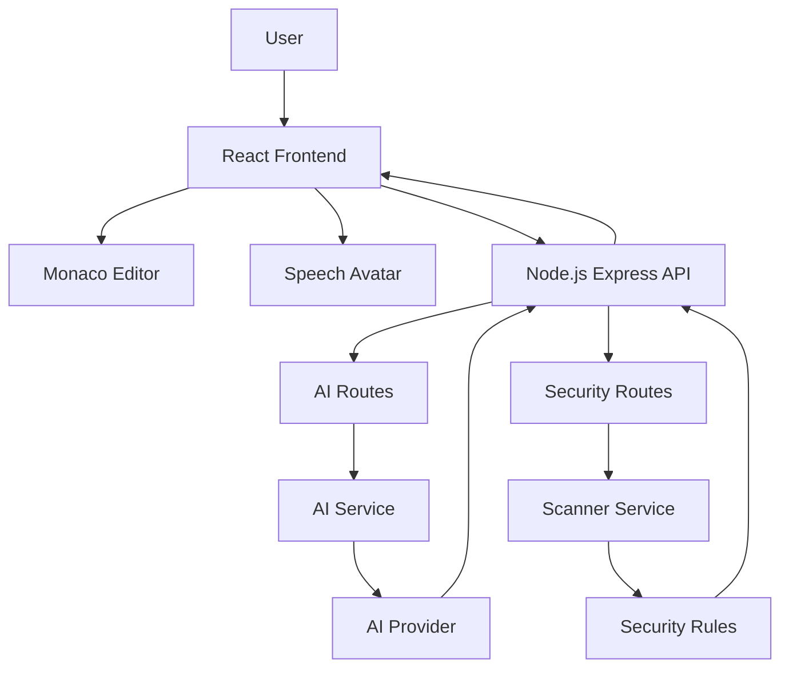

# System Architecture Diagram

```mermaid
flowchart TD
  User["User"] --> Frontend["React Frontend"]
  Frontend --> Editor["Monaco Editor"]
  Frontend --> Avatar["Speech Avatar"]
  Frontend --> API["Node.js Express API"]
  API --> AIRoutes["AI Routes"]
  API --> SecurityRoutes["Security Routes"]
  AIRoutes --> AIService["AI Service"]
  SecurityRoutes --> Scanner["Scanner Service"]
  AIService --> Provider["AI Provider"]
  Scanner --> Rules["Security Rules"]
  Provider --> API
  Rules --> API
  API --> Frontend
```

