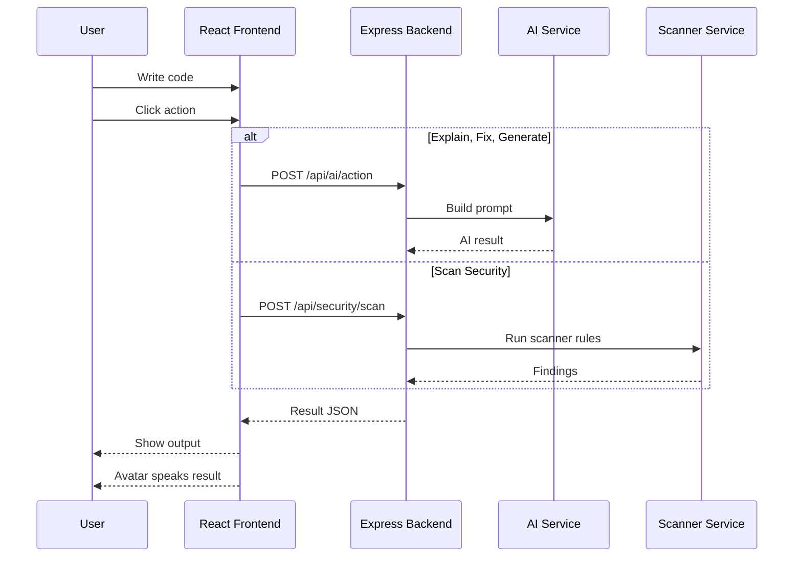

# Sequence Diagram

```mermaid
sequenceDiagram
  participant U as User
  participant F as React Frontend
  participant B as Express Backend
  participant A as AI Service
  participant S as Scanner Service

  U->>F: Write code
  U->>F: Click action
  alt Explain, Fix, Generate
    F->>B: POST /api/ai/action
    B->>A: Build prompt
    A-->>B: AI result
  else Scan Security
    F->>B: POST /api/security/scan
    B->>S: Run scanner rules
    S-->>B: Findings
  end
  B-->>F: Result JSON
  F-->>U: Show output
  F-->>U: Avatar speaks result
```

