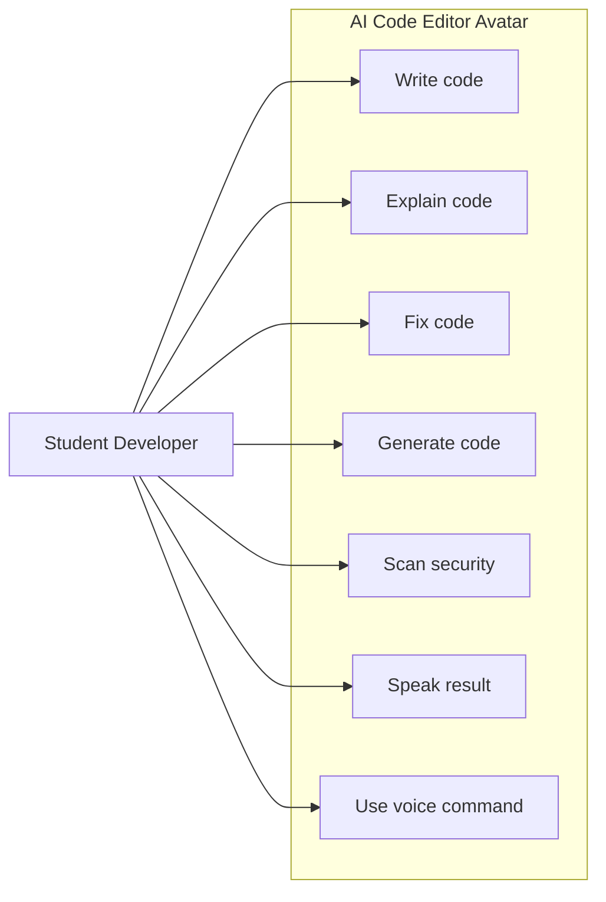

# Use Case Diagram

```mermaid
flowchart LR
  User["Student Developer"]

  subgraph System["AI Code Editor Avatar"]
    Write["Write code"]
    Explain["Explain code"]
    Fix["Fix code"]
    Generate["Generate code"]
    Scan["Scan security"]
    Speak["Speak result"]
    Voice["Use voice command"]
  end

  User --> Write
  User --> Explain
  User --> Fix
  User --> Generate
  User --> Scan
  User --> Speak
  User --> Voice
```

